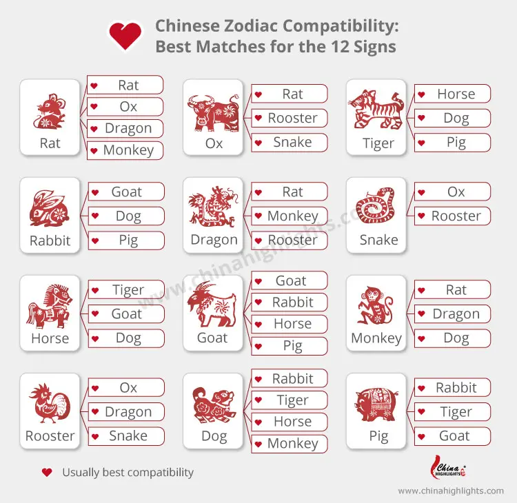

# Chinese Zodiac Compatibility



Source: [ChinaHighlights.com](https://www.chinahighlights.com/travelguide/chinese-zodiac/)

## Usage

```swift
import ChineseZodiacCompatibility

let compatibilities = Compatibilities.of(animal: .Tiger)
print(compatibilities) // [.Dog, .Horse, .Pig]
```
